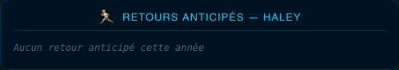
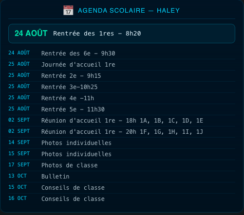

# Cabanga pour Home Assistant

Intégration custom (non officielle) pour importer dans Home Assistant les
données de l'app scolaire [Cabanga](https://www.cabanga.be) (société
Scolares) : journal de classe, devoirs à faire, évaluations, absences et
retours anticipés.

⚠️ Projet personnel basé sur du reverse engineering de l'app web. Aucun lien
avec Scolares/Cabanga. Peut casser si leur API change.

## Ce que ça fait

Pour chaque enfant configuré, six capteurs sont créés :

- **Journal de classe {enfant}** — nombre de cours aujourd'hui, avec heure/matière/sujet en attribut
- **Devoirs à faire {enfant}** — nombre de devoirs non cochés comme faits, avec détail en attribut
- **Dernière évaluation {enfant}** — dernière note reçue (`score`), avec matière/titre/date, les 5 dernières évaluations, et l'historique complet de l'année en attribut
- **Retours anticipés {enfant}** — nombre de sorties avant l'heure sur l'année en cours, avec date/heure/motif/classe/autorisation en attribut
- **Agenda {enfant}** — nombre d'événements à venir dans le calendrier scolaire officiel (rentrées, bulletins, conseils de classe, réunions, congés pédagogiques...), avec le tout prochain événement et la liste complète de l'année en attribut
- **Absences {enfant}** — ⚠️ **beta** : structure JSON jamais confirmée avec des données réelles (aucun élève testé n'avait d'absence enregistrée à ce jour). Le capteur reste générique : nombre brut d'entrées comme état, liste brute telle que renvoyée par l'API dans l'attribut `absences_brutes`. Si tu obtiens une vraie donnée, une issue/PR avec le JSON exact est bienvenue pour finaliser ce capteur comme les autres.

## Pourquoi il faut un refresh_token manuel

Le login Cabanga passe par Keycloak avec un captcha **Cloudflare Turnstile**.
Impossible d'automatiser un login username/password. En revanche, une fois
connecté une fois, Keycloak fournit un `refresh_token` valable **7 jours**,
qui se renouvelle automatiquement à chaque utilisation par l'intégration —
tant que Home Assistant tourne et interroge l'API au moins une fois par
semaine, la connexion reste valide indéfiniment sans repasser par le
captcha.

Il faut donc récupérer ce refresh_token **une seule fois manuellement**, à
la configuration initiale (et le refaire uniquement si l'intégration reste
éteinte plus de 7 jours d'affilée).

### Récupérer le refresh_token

1. Ouvre `https://app.cabanga.be/app` dans Chrome/Firefox
2. Ouvre les DevTools (F12) → onglet **Network** → coche "Preserve log"
3. Filtre sur **All** (pas juste Fetch/XHR) et tape `token` dans la barre de recherche
4. Connecte-toi normalement à Cabanga
5. Une requête `token` apparaît (vers `login.scolares.be`) → clique dessus → onglet **Response**
6. Copie la valeur du champ `refresh_token` (la chaîne complète commençant par `eyJ...`)

### Récupérer les IDs élèves et l'ID école

Chaque enfant peut être dans une école différente — chaque élève porte donc
son propre identifiant école.

- **ID école** : visible dans n'importe quelle URL d'API pour cet enfant, ex.
  `https://api.scolares.be/cabanga/api/schools/XXXXX/...` → ici `XXXXX`
- **ID élève** : dans le menu Cabanga, sélectionne l'enfant concerné, clique
  sur "A faire" ou "Evaluations", regarde l'URL de la requête réseau, ex.
  `.../students/YYYYYYYY/diary?...` → ici `YYYYYYYY`

Répète pour chaque enfant si plusieurs écoles sont concernées.

## Installation

### Via HACS (dépôt personnalisé)

1. HACS → menu ⋮ → **Dépôts personnalisés**
2. Ajoute l'URL de ce repo GitHub, catégorie **Intégration**
3. Installe "Cabanga" depuis HACS
4. Redémarre Home Assistant
5. Paramètres → Appareils et services → Ajouter une intégration → cherche "Cabanga"
6. Renseigne :
   - **Refresh token** : la valeur récupérée ci-dessus
   - **Élèves** : format `ecole:id:Nom, ecole:id:Nom` — ex.
     `ECOLE1:11111111:Prenom1, ECOLE2:22222222:Prenom2` (une seule entrée
     couvre tous les enfants, même s'ils sont dans des écoles différentes,
     tant qu'ils partagent le même compte parent)

### Installation manuelle

Copie le dossier `custom_components/cabanga` dans le dossier
`custom_components` de ta config Home Assistant, redémarre, puis suis les
étapes 5-6 ci-dessus.

## Limitations connues

- Le capteur **Absences** reste générique (voir ci-dessus) faute de vraie
  donnée observée pour en confirmer la structure exacte
- Le mapping id→nom des élèves doit être renseigné manuellement (pas
  d'auto-découverte via l'endpoint `profiles`, exploré plus tard)
- Si le refresh_token expire complètement (HA éteint plus de 7 jours
  d'affilée), un flux de ré-authentification natif HA se déclenche
  automatiquement (notification + bouton "Ré-authentifier" sur
  l'intégration) — il suffit de coller un nouveau refresh_token, la config
  des élèves est conservée

## Cartes Lovelace (style Nexus HUD)

Quatre cartes prêtes à l'emploi sont fournies dans
[`examples/lovelace/`](examples/lovelace/), dans le style visuel "Nexus HUD"
(fond navy, bordures/glow cyan, police Orbitron/Share Tech Mono). Toutes
incluent `grid_options: columns: full`, pensé pour les vues Lovelace de
type **Sections**.

### Carte principale — journal, devoirs, dernières évaluations

Journal de classe du jour, devoirs à faire (non cochés comme faits), et les
5 dernières évaluations avec badge coloré (🟢 ≥65%, 🟠 ≥50%, 🔴 en dessous).
Un double-clic sur la carte ouvre une popup (via
[`browser_mod`](https://github.com/thomasloven/hass-browser_mod)) avec
l'historique complet des évaluations de l'année — pratique pour garder le
dashboard compact tout en gardant l'historique à portée de clic.

→ [`examples/lovelace/carte-principale.yaml`](examples/lovelace/carte-principale.yaml)
— nécessite `custom:button-card`, `browser_mod` (optionnel, pour la popup)

### Carte historique — toutes les évaluations de l'année

Liste scrollable de toutes les évaluations de l'année scolaire en cours,
avec moyenne pondérée globale en en-tête.

→ [`examples/lovelace/carte-historique.yaml`](examples/lovelace/carte-historique.yaml)
— nécessite `card-mod`

### Carte moyennes par matière

Moyenne pondérée par matière depuis le début de l'année, triée par ordre
croissant (matières les plus faibles en premier).

→ [`examples/lovelace/carte-moyennes.yaml`](examples/lovelace/carte-moyennes.yaml)
— nécessite `custom:button-card`, `card-mod`

### Carte retours anticipés

Liste des sorties avant l'heure enregistrées sur l'année scolaire en cours :
date, heure, motif, classe concernée, et qui a autorisé la sortie.

→ [`examples/lovelace/carte-retours-anticipes.yaml`](examples/lovelace/carte-retours-anticipes.yaml)
— nécessite `custom:button-card`, `card-mod`

### Carte agenda scolaire

Calendrier scolaire officiel : le tout prochain événement mis en avant
(rentrée, bulletin, conseil de classe, réunion...), suivi des prochains
événements en liste compacte. Double-clic pour voir l'année complète en
popup.

→ [`examples/lovelace/carte-agenda.yaml`](examples/lovelace/carte-agenda.yaml)
— nécessite `custom:button-card`, `card-mod`, `browser_mod` (optionnel, pour la popup)

### Installation d'une carte

1. Ouvre le fichier `.yaml` correspondant, copie tout le contenu
2. Dans ton dashboard Lovelace, ajoute une carte → mode YAML (icône crayon
   ou "Modifier en YAML")
3. Colle le contenu, remplace `haley`/`HALEY` par l'entity_id et le nom de
   l'enfant concerné
4. Duplique pour chaque enfant configuré dans l'intégration

## Structure technique

- `api.py` — client HTTP (Keycloak token refresh + endpoints Cabanga :
  diary, evaluations, absences, early departures)
- `coordinator.py` — polling centralisé (toutes les 3h par défaut), persiste
  le refresh_token à jour dans le config entry après chaque rotation, lève
  `ConfigEntryAuthFailed` si le token expire pour déclencher le flux de
  ré-authentification natif HA
- `config_flow.py` — formulaire de configuration + validation du token +
  flux de ré-authentification (`async_step_reauth`)
- `sensor.py` — les 5 entités par enfant
